# Spatial Transcriptomics with Histology - A Hands-on Tutorial

A beginner-friendly but research-grade tutorial series that teaches **spatial
transcriptomics (ST)** analysis on **10x Genomics Visium** data with a paired
**H&E histology image**.

It is written for a reader who is comfortable with **medical image analysis**
(CT/MRI preprocessing, voxels/pixels, segmentation, feature extraction, CNNs,
ML evaluation) but **new to gene-expression data**. Throughout, new concepts are
introduced with analogies to medical imaging.

The worked dataset is the **Squidpy built-in 10x Visium mouse-brain H&E sample**
(`squidpy.datasets.visium_hne_adata()`), which downloads the count matrix,
spatial coordinates, H&E image, and scale factors in a single reproducible call -
no credentials, no manual downloads. Notebook `02` also documents the raw 10x
download path (e.g. human breast cancer) as an alternative.

---

## What you will build

Running the notebooks in order produces:

- A downloaded/cached dataset directory
- An `AnnData` object loaded from Visium data
- QC plots + `outputs/qc_summary.csv`
- Normalized / log-transformed expression, highly variable genes, PCA/UMAP
- Leiden clustering, spatial domains + `outputs/cluster_markers.csv`
- Spatial expression plots overlaid on the H&E image
- Spatially variable genes (Moran's I)
- Per-spot histology image features + `outputs/image_features.csv`
- Correlation / regression / classification linking histology to expression
  + `outputs/integration_metrics.csv`
- Optional marker-based cell-type module scoring
- A final summary connecting the workflow to pharma drug discovery

Intermediate `AnnData` objects are cached in `data/processed/` so each notebook
can be run independently.

---

## Notebooks

| # | Notebook | Topic |
|---|----------|-------|
| 00 | `00_overview_spatial_transcriptomics.ipynb` | What ST is; bulk vs single-cell vs spatial; pharma relevance |
| 01 | `01_environment_setup.ipynb` | Install + verify the stack; AnnData anatomy |
| 02 | `02_fetch_public_visium_data.ipynb` | Programmatically fetch the Visium dataset |
| 03 | `03_load_expression_and_spatial_metadata.ipynb` | `.X`, `.obs`, `.var`, `.obsm`, `.uns`; registration |
| 04 | `04_qc_and_preprocessing.ipynb` | QC, filtering, normalization, HVGs, PCA |
| 05 | `05_histology_image_loading_and_preprocessing.ipynb` | H&E image loading + preprocessing |
| 06 | `06_spatial_visualization.ipynb` | Expression/QC overlays on histology |
| 07 | `07_clustering_and_spatial_domains.ipynb` | Neighbors, UMAP, Leiden, marker genes |
| 08 | `08_spatially_variable_genes.ipynb` | Moran's I spatial autocorrelation |
| 09 | `09_image_feature_extraction_from_histology.ipynb` | Per-spot handcrafted image features |
| 10 | `10_integrating_histology_features_with_gene_expression.ipynb` | Correlation, regression, classification |
| 11 | `11_cell_type_annotation_and_deconvolution_optional.ipynb` | Module scoring; deconvolution concepts |
| 12 | `12_summary_research_extensions.ipynb` | Recap + pharma research extensions |

Each notebook follows the same structure: **Learning objectives -> Concepts ->
Code -> Expected outputs -> Common pitfalls -> Interpretation -> "What this means
biologically"**.

Several notebooks include **"Your turn" exercises** (expandable answer blocks) and
save key plots to `outputs/figures/` for quick reference.

---

## Figure gallery

Canonical plots are saved under [`outputs/figures/`](outputs/figures/) so you can
preview results without opening large notebooks. Regenerate anytime after running
the pipeline:

```bash
conda activate spatial-tx
python scripts/generate_gallery_figures.py
```

| Figure | Notebook | What it shows |
|--------|----------|---------------|
| 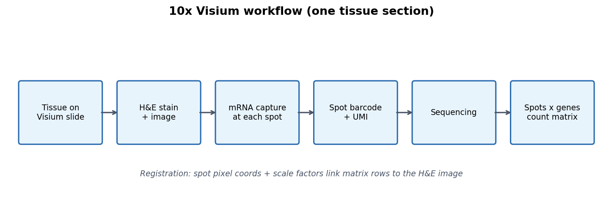 | 00 | Visium assay steps |
| 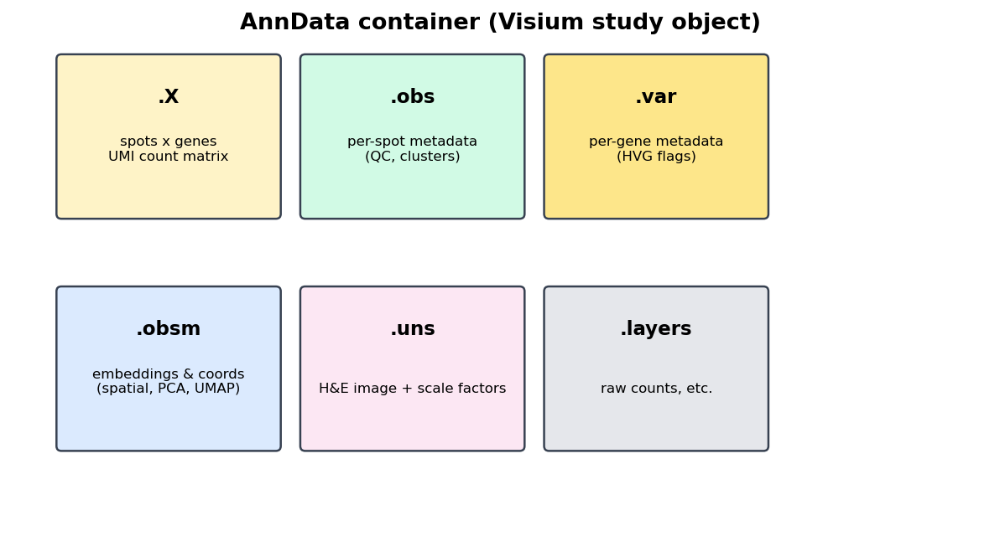 | 00 | AnnData container layout |
| 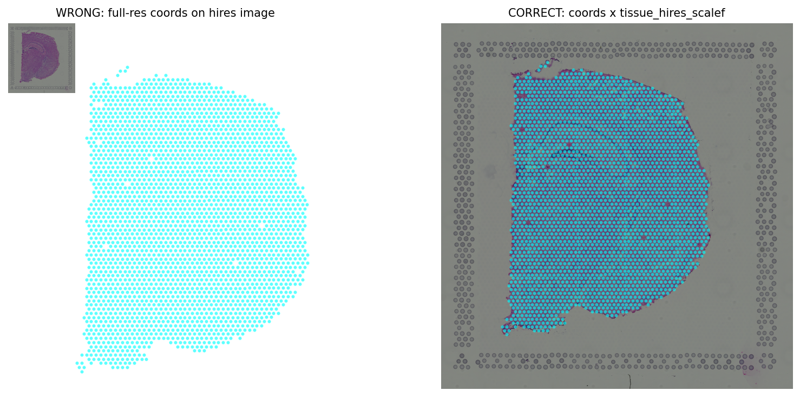 | 03 | Wrong vs correct spot overlay |
| 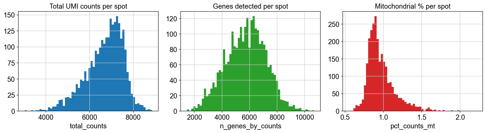 | 04 | Counts, genes, mito % distributions |
| 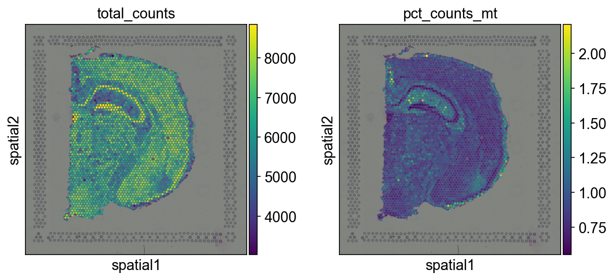 | 04 | QC metrics on tissue |
| 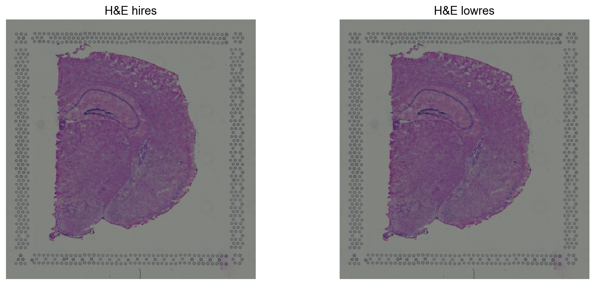 | 05 | High- and low-res H&E |
| 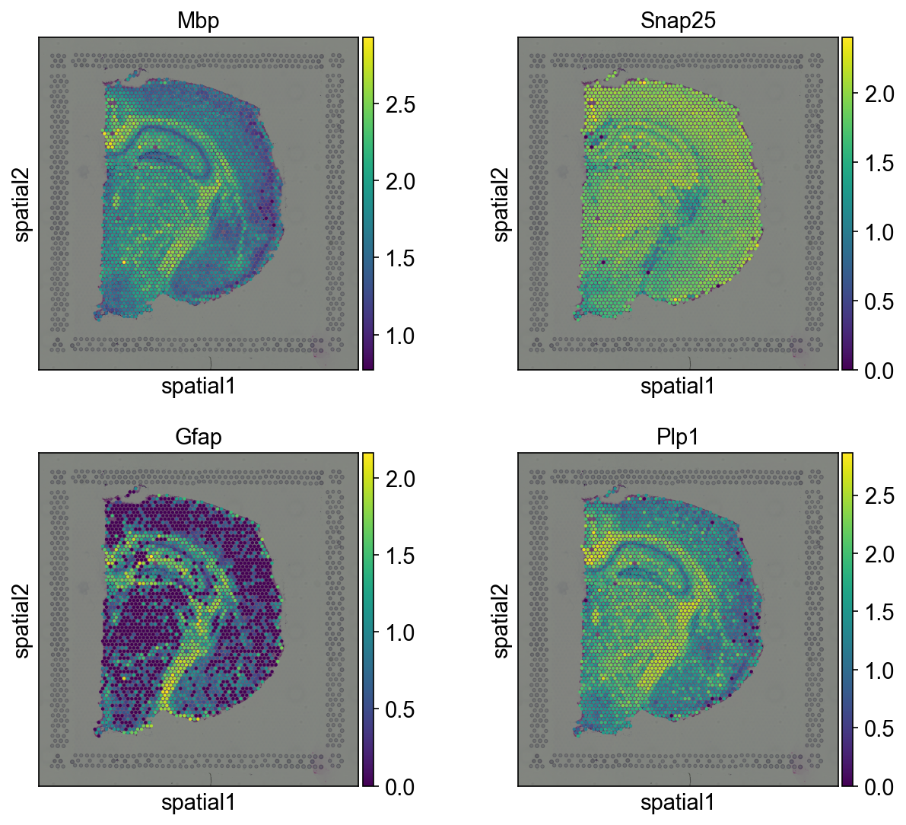 | 06 | Marker genes on tissue |
| 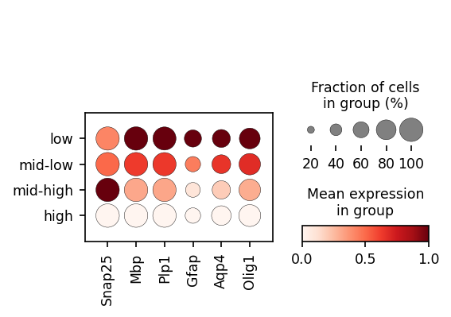 | 06 | Marker expression by depth bin |
| 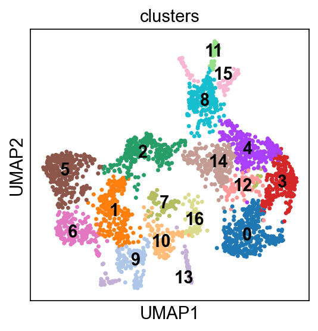 | 07 | Leiden clusters (UMAP) |
| 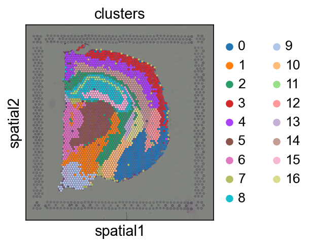 | 07 | Leiden clusters on H&E |
| 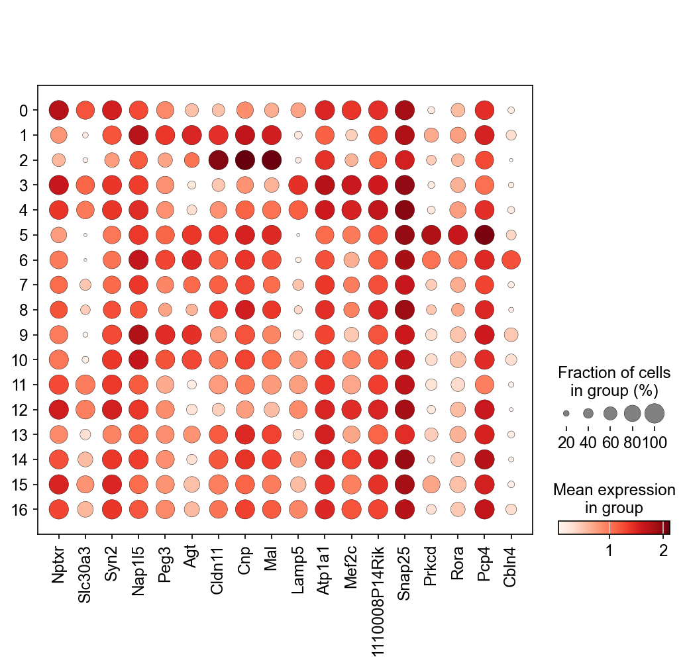 | 07 | Top markers per cluster |
| 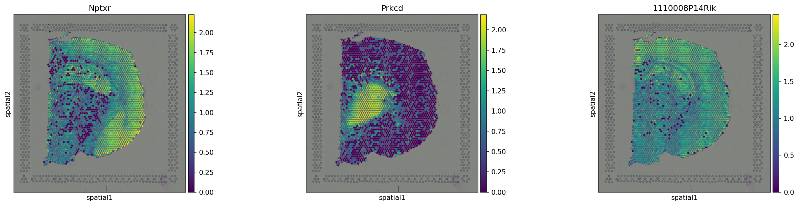 | 07 | #1 marker per major cluster |
| 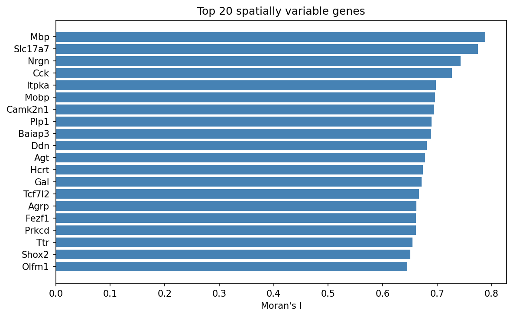 | 08 | Top spatially variable genes |
| 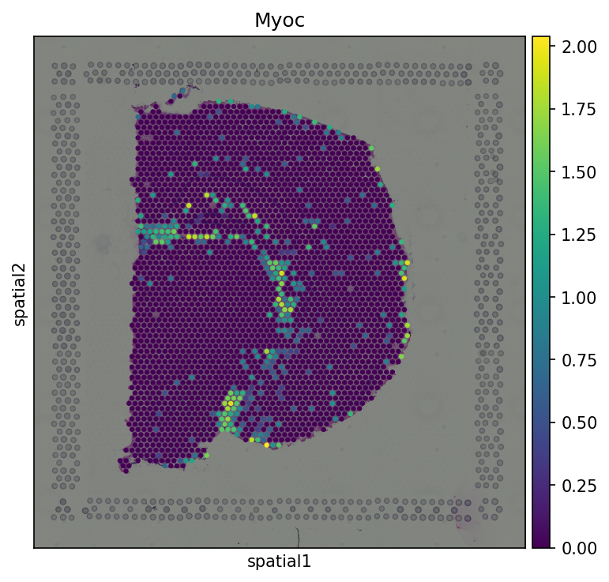 | 08 | High-variance, low spatial structure |
| 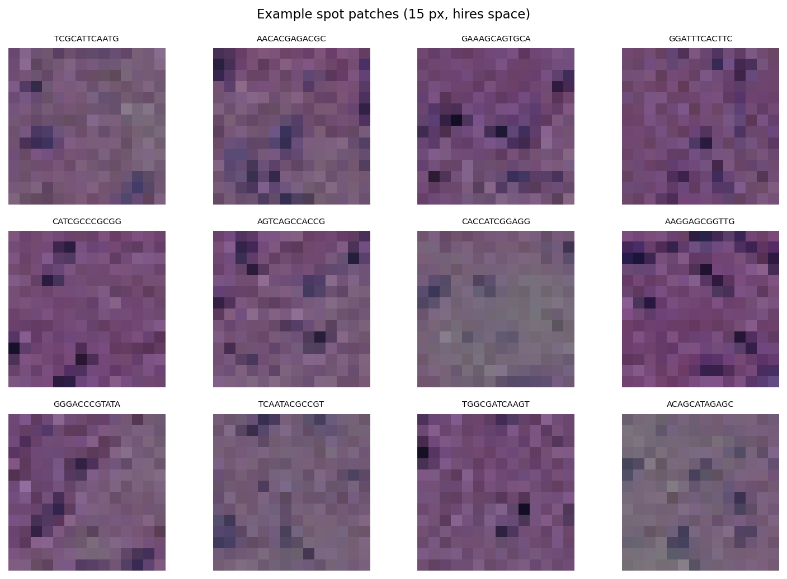 | 09 | Example per-spot image patches |
| 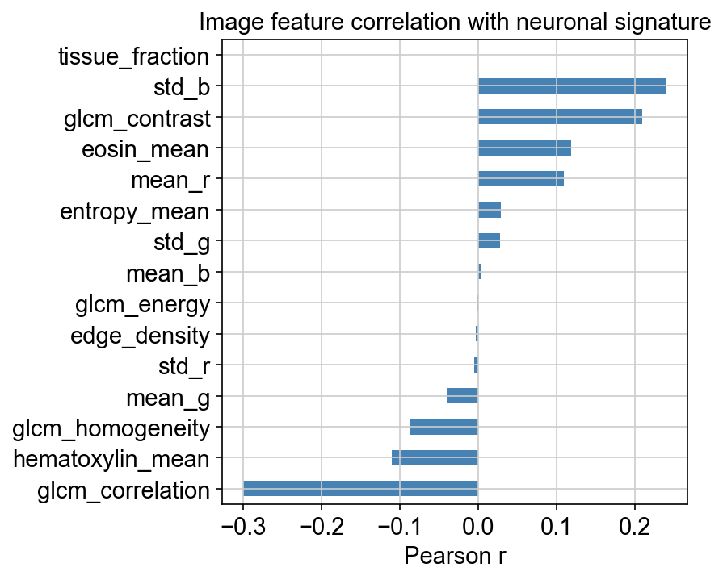 | 10 | Histology vs expression correlation |
| 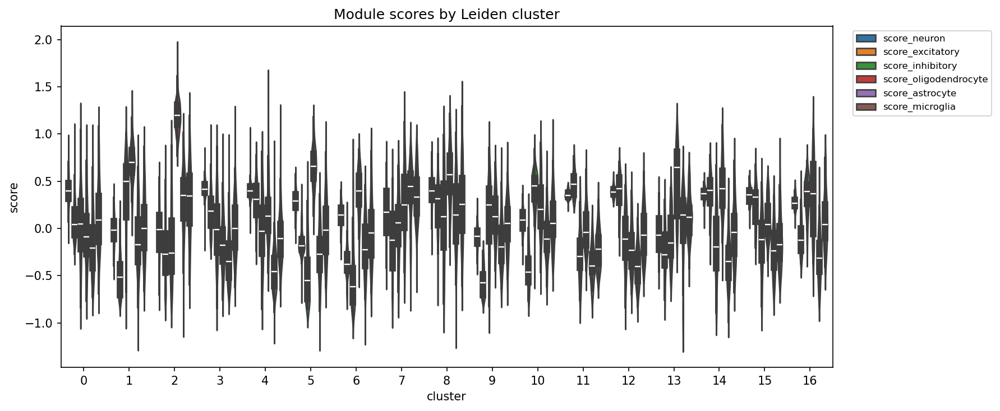 | 11 | Cell-program scores by cluster |

---

## Setup

Python **3.10 or 3.11** is recommended (some dependencies can lag on 3.13).

### Option A - conda (recommended)

```bash
conda env create -f environment.yml
conda activate spatial-tx
python -m ipykernel install --user --name spatial-tx
jupyter lab   # or: jupyter notebook
```

### Option B - pip / venv

```bash
python -m venv .venv
source .venv/bin/activate        # Windows: .venv\Scripts\activate
pip install --upgrade pip
pip install -r requirements.txt
jupyter lab
```

Then open the notebooks in order, starting with `00_overview_spatial_transcriptomics.ipynb`.
All notebooks are pinned to the **`Python (spatial-tx)`** kernel — Jupyter should select it
automatically. Notebook `01` includes a version-check cell to confirm the install.

---

## Repository layout

```
.
├── 00_..12_*.ipynb        # the tutorial notebooks
├── utils/st_helpers.py    # shared helpers (paths, seeds, dataset loading, gene checks)
├── scripts/               # patch_notebooks.py, generate_gallery_figures.py
├── data/                  # downloaded + processed data (git-ignored)
│   ├── raw/
│   └── processed/         # *.h5ad caches
├── outputs/               # CSVs (git-ignored)
│   └── figures/           # gallery PNGs (committed for README preview)
├── requirements.txt
├── environment.yml
└── README.md
```

---

## Conceptual glossary

- **Spot** - One Visium capture location (~55 um across), arranged on a hexagonal
  grid. Each spot pools mRNA from the few cells sitting under it. *A spot is NOT a
  single cell* - it is a tiny local "mini-bulk." (Analogy: a voxel that averages
  whatever tissue falls inside it.)
- **UMI (Unique Molecular Identifier)** - A random barcode attached to each
  captured mRNA molecule before amplification, so you can count *distinct*
  molecules instead of PCR duplicates. "Counts" in the matrix are UMI counts.
- **Count matrix** - A spots x genes table of UMI counts: how many molecules of
  each gene were captured at each spot. Sparse (mostly zeros).
- **AnnData** - The Python container (from the `anndata` package) holding the
  count matrix (`.X`), per-spot metadata (`.obs`), per-gene metadata (`.var`),
  embeddings/coordinates (`.obsm`), and unstructured data like the image
  (`.uns`). (Analogy: a study object bundling the image volume + voxel labels +
  metadata.)
- **H&E** - Hematoxylin & Eosin stain. Hematoxylin stains nuclei blue/purple;
  eosin stains cytoplasm/extracellular protein pink. The standard histology view.
- **Spatial coordinates** - The pixel (x, y) location of each spot in the
  full-resolution image, stored in `adata.obsm["spatial"]`. These register the
  count matrix to the image.
- **Highly variable genes (HVGs)** - Genes whose expression varies most across
  spots; selected to focus dimensionality reduction/clustering on informative
  signal. (Analogy: feature selection by variance.)
- **Spatially variable genes (SVGs)** - Genes whose expression is spatially
  *structured* (nearby spots resemble each other) rather than just high-variance.
  Detected with spatial autocorrelation.
- **Leiden clustering** - A community-detection algorithm run on the
  nearest-neighbor graph in expression space to group spots into transcriptomic
  clusters. (Analogy: unsupervised segmentation in feature space.)
- **Moran's I** - A spatial autocorrelation statistic (~ -1 to +1). High positive
  values mean a gene's expression forms coherent spatial patterns.
- **Deconvolution** - Estimating the *proportions of cell types* contributing to
  each multi-cell spot, usually using an external single-cell reference.

---

## Troubleshooting

- **`ModuleNotFoundError: scanpy` / `squidpy`** - The kernel is not the tutorial
  environment. Re-run the install, then select the `spatial-tx` kernel in Jupyter
  (Kernel -> Change kernel).
- **Leiden errors / `leidenalg` not found** - Install `leidenalg` and `igraph`
  (both are in `requirements.txt` / `environment.yml`). The helper
  `run_leiden()` tries the modern igraph flavor and falls back automatically.
- **Install issues on Python 3.13** - Some packages may not yet ship wheels.
  Create a Python **3.11** environment via `environment.yml`.
- **First dataset download is slow or fails** - `squidpy.datasets.visium_hne_adata()`
  downloads on first use and caches afterward. Re-run the cell; check network/proxy.
- **`KeyError` for a gene when plotting** - Gene panels are dataset- and
  species-specific. Always filter with `genes_present(adata, [...])` first (every
  notebook does this). Inspect `adata.var_names` to find valid names.
- **Spatial overlay looks misaligned** - You are likely mixing resolutions. Spot
  coordinates in `obsm["spatial"]` are full-resolution pixels; multiply by the
  matching scale factor (`tissue_hires_scalef` / `tissue_lowres_scalef`) before
  indexing into the `hires`/`lowres` image. Let `sq.pl.spatial_scatter` /
  `sc.pl.spatial` handle this for you when possible.
- **Kernel runs out of memory** - Close other notebooks; restart the kernel; use
  the cached `.h5ad` instead of recomputing upstream steps.

---

## Data citation

10x Genomics Visium mouse brain (H&E) sample, distributed via
[Squidpy](https://squidpy.readthedocs.io/). Squidpy: Palla et al., *Nature
Methods* (2022). Scanpy: Wolf et al., *Genome Biology* (2018). AnnData: Virshup
et al. (2021).

This tutorial uses only public data and requires no paid or private credentials.
